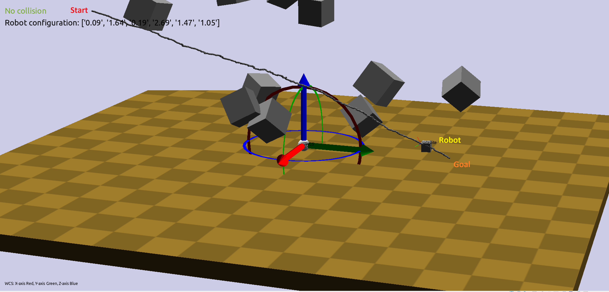

# Robot Motion Planning

<i>Implementation of bi-directional RRT for a 3D rigid holonomic robot</i>

## cube.off, block.off and sphere.off:

These files are used by Klamp’t for visualization of objects and these files represents the geometry of the objects.

## cube.rob:

   
This file describes the robot which is used by Klamp’t for visualization.

## world.xml:

   
This is an xml file that represents the environment, the robot described by the ‘.rob’ file and the terrain in the environment.

## cube6.py:

This file has the implementation of the class cube6DoF. This class is a wrapper class that redefines the set and get configuration functions of the robot. As the robot can both translate in XYZ directions and rotate on its own XYZ axis, this gives the robot six degrees of freedom. As the dimensions of the robot are known, only the coordinates of a reference point on the robot and orientation are needed to define it it’s configuration in the environment. Thus, the configuration of the robot is defined by six elements. The first three elements represent the X, Y and Z coordinates of a reference point on the robot and the next three elements represent the Euler angles with respect to the Z, Y and X axis of the robot respectively. The getConfig method give the configuration of the robot and the setConfig method sets the robot to a certain configuration in the environment. This is for visualization in Klamp’t.

## addToEnv.py:

This file defines some functions to add the obstacles to the environment based on the files like cube.off and sphere.off that define the geometry of the obstacles. The obstacles are stationary. Similar to the robot, given the dimensions and geometry, an obstacle can be defined in the environment based on the reference point and its orientation. Usually the Klamp’t takes care of the geometry. So, six elements, first three representing the position and the next three representing the orientation along with their dimensions and geometry are needed to define the obstacles. In this project, some cubes are added to the environment as obstacles. The getCube method makes use of the cube.off file and takes the dimensions and configuration of the obstacle and creates a 3D model for it. The getCubeObs method uses the getCube method and generates a certain number of obstacles at random configurations based on the count provided. This method returns the obstacles details like position, orientation and their dimensions which are need for collision detection. The getSphere and getSphereObs do the same job as the getCube and getCubeObs and they are being used just for visualization of the bounding spheres used in the collision detection.

## mathUtils.py:

This file has two methods to compute the rotation matrix and its inverse based on the Euler angles in the order of ZYX. This comes in handy mostly during the collision detection.

## sphericalCollisionChecker.py:

This file implements the bounding sphere collision checking idea. It has the SphericalCollisionChecker class which takes in the configurations of the obstacles and their dimensions. The core idea of this class is to take each obstacle, approximate it to a rectangular parallelepiped based on its dimensions along its X, Y and Z axis, find the center of the rectangular parallelepiped. This same center will serve as the center of the bounding sphere. Next, the length of the diagonal passing through the center of the rectangular parallelepiped is calculated. This length will be the diameter of the bounding sphere. The same process is repeated for a given configuration of robot as well. Now, the distance from the center of the sphere bounding the robot to the center of the sphere bounding the obstacle are calculated and compared with the sum of radii of sphere of the robot and that of the obstacle. If the distance between them is less than the sum of the radii, then the spheres are in collision which in turn represents that the robot is colliding with the obstacle. This process is repeated for each one of the obstacles present in the environment. The getRadius method calculates the radius of the sphere bounding the obstacle or robot based on its dimensions. The getSpheres method calculated the centers of the spheres for each obstacle based on its position and orientation. The checkCollision method checks for collision between the spheres representing the robot and each of the obstacles. The collisions between the spheres bounding obstacles are ignored. This method returns True if a collision is present with the sphere bounding the robot.

## RRT.py:

This is the main class that implements the bi-directional RRT algorithm to find a collision free path for the robot to move from a start configuration to the goal configuration. First, the environment limits, the start and goal configurations of the robot, the maximum iterations after which the algorithm will stop, the max change the robot can make in its position and orientation for each iteration are defined. It has its own data structure defined by the Node class. This data structure stores the configuration of the robot and its parent configuration from which it was extended. It has a checkCollision method which uses the Klamp’t’s internal collision detection. This method is not being used in the implementation. The *new_point* method creates a new random configuration of the robot in the given environment limits. The distance between two orientations is calculated using the *orieintation_dist* method. This method makes use of the so3 from the Klamp’t’s math library to calculate the distance between two orientations defined by the Z, Y and X Euler angles. The *nearest_neighbor* method iterates through the tree to find the closest configuration, in the tree structure, to the random configuration generated in the RRT algorithm. The *new_state* method takes the nearest neighbor returned by the previous method and generates a new configuration towards the random configuration. The distance at which it generates the new configuration is based on the ratio of the maximum step the robot could take and the distance between the nearest neighbor and the random configuration towards which the tree is growing. The calculation is done using the formula {(1-ratio) * nearest-neighbor + ratio * random-config}. If the random configuration is far from the nearest neighbor, then the robot will take only a small step towards the random point. If it is close to the random point, it will become greedy to reach it and tries to take a big step towards it. The same approach holds for the orientation. In case of orientation, the change in orientations about Z, Y an X are calculated seperately using the same formula. It then checks if the new configuration of the robot for collisions using the SphericalCollisionChecker class. If there is a collision, it returns a status of -1. If it reaches the random configuration, it returns 0. Else, it returns 1 to indicate that the robot advanced towards the random configuration. The extend method extends the given tree towards the random configuration using the *nearest_neighbor* and *new_state* methods. It then returns the status returned by the *new_state* method. The isClose is to check the closeness between floating point numbers. The *compare_cooordinates* compares if two coordinates are equal. The *compare_nodes* uses the above method and *orientation_dist* method to compare two configurations of the robot for closeness. The display method gives a plot of the final path from start to goal using matplotlib. The *get_path* method traces back, from the intersecting point, along the two trees growing from start and goal and then returns the complete path from start to goal by combining the traced paths. The rri_bidirectional method is the implementation of the bi-directional RRT algorithm. It uses all the above described methods. It first checks if the start and goal configurations are collision free. It then iterates for the maximum number of iterations allowed and during each iteration, it generates a random configuration in the environment checks if it is collision free and then extends the first tree towards the random point. The second tree is extended towards the new node added in the first tree. During these iterations it checks if the two trees meet. If they meet, it gets the final path from start to goal and returns it. If it reaches maximum number of iterations, it will say that it could not find a path. During these iterations, it checks if the trees are trapped. If the trees do not extend for some thousand iterations, it returns saying that the trees are trapped. If the status of any of the two trees is -1, it skips the iteration and starts again with a new one. If the status of the second tree is 0, then the two trees meet.

## simulate.py:

This is the main file which combines the pieces of visualization and motion planning together. This is mainly for visualization using Klamp’t. It takes in a .xml file defining the world as an argument. For this project, it takes the world.xml file. It creates the environment and load all items based on the .xml file passed. It then adds the obstacles to the environment and initializes an object of the collision checker with the positions, orientations and dimensions of the obstacles. This object is passed along with any method that has the need to do collision checking within it. Then it prepares the visualizer and calls the *rrt_bidirectional* from RRT.py file. This method returns the path if found, else, it returns None. It then starts the visualization and runs it for a predefined time (in sec). The visualization shows the robot moving along the final path from start to goal configurations. It also performs collision checking during the visualization.

## Usage:

         python2.7 simulate.py world.xml 

## Results:

The plot in Figure-1 shows the path generated using the bi-directional RRT. In this plot, the orientations and obstacles are not shown. The start configuration is at [2, -2, 2, 0, 0,0] and goal configuration is at [0, 2, 0, π, π/2, π/4].

  

Figure-2 shows the animation of the robot in Klampt, moving through the environment avoiding obstacles from start configuration to goal configuration along the path generated by the bi-directional RRT.

Figure-3 shows the visualization of the spheres bounding the obstacles which are being used for the collision detection.

